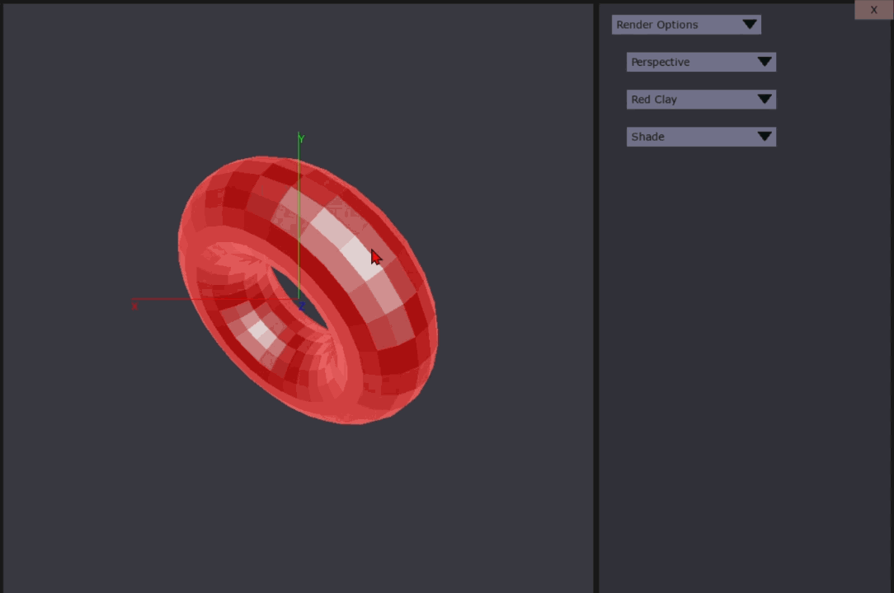

# python-3D-shapes
Program from 2016 experimenting with 3D projection. 
The code has been updated to run in python 3.
Uses pygame for drawing the graphics.

# How to run
## Dependecies
- Any version of python 3.
- pygame
```
python3 -m pip install -U pygame --user
```
## Run
```
python3 ./src/main.py
```

# Preview





A few shapes has been added into the program. As you can see the program struggles with putting the triangles in the correct order for the box shape. 
This is because it has sharp corners which the naive way of dealing with what triangle is in front.
